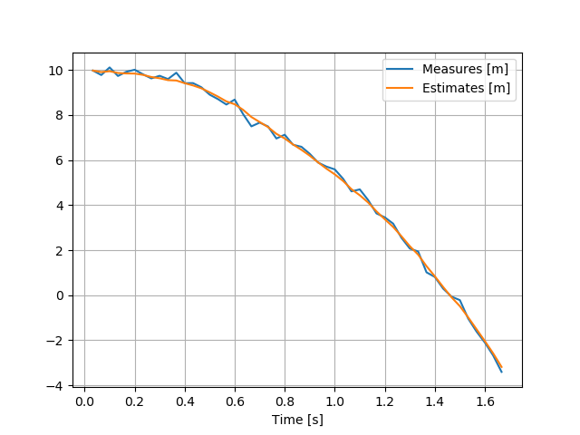

# Linear Kalman Filter


A basic Linear Kalman filter implementation in C++ using the [Eigen](http://eigen.tuxfamily.org/) library.

## Use this as a library
Just use `kalman.cpp` and `kalman.hpp` as self-contained library. Eigen is the only dependency.

## Example program
Source file `example.cpp` contains a simple example of an estimation of uniformly accelerated motion, where position is the only measure (affected by Gaussian noise).

Test it with:
```shell
mkdir build && cd build
cmake ..
make
./example
```

The output log file can be processed with `plot_log.py`.
